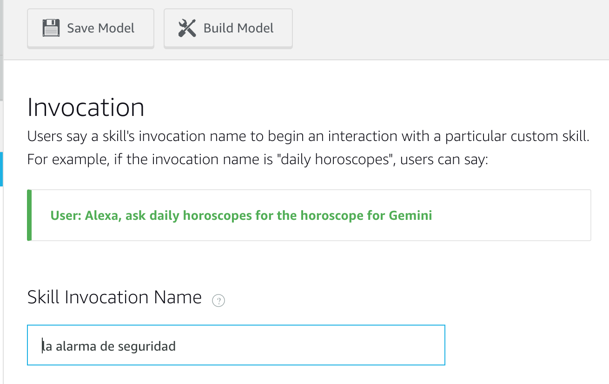
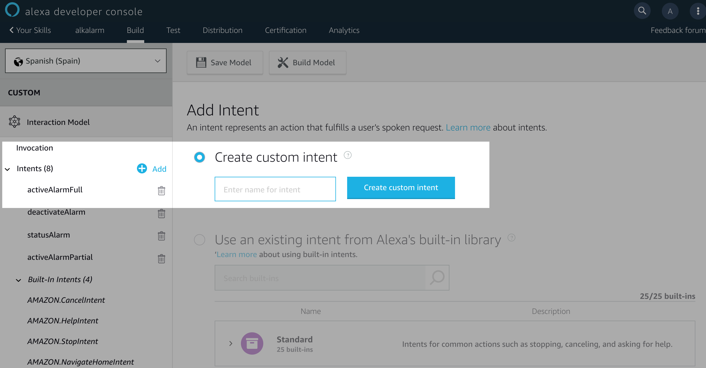
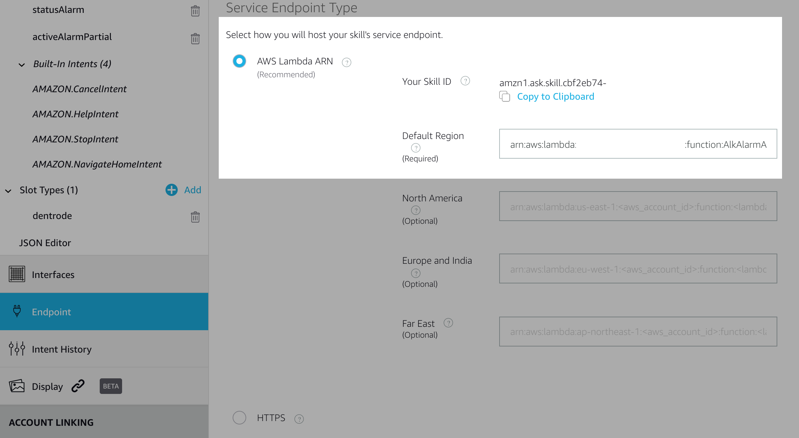

Few weeks ago, I wrote a post about my personal project for a Security Home Alarm System based on Golang, Raspberry PI and 433Mhz sensors ( [see again here](https://alknopfler.wordpress.com/2018/09/29/design-your-own-home-alarm-system-using-go/) ).

After that, I thought that the next step for that project could be an Alexa Skill integration, in order to control and manage the Alarm System just with my voice.

This week, I bought a new Amazon Echo Dot, and today, the new functionality is ready to share with all of you ;)

[](https://github.com/alknopfler/alkalarm-alexa-skills/blob/master/images/schema.jpg)

For example, we could manage the alarm system using:

_**Alexa, open the alarm system, and activate it, after 30 second**_

_**Alexa, open the alarm system, and activate it just for the perimeter**_

_**Alexa, open the alarm system, and stop it**_

_**Alexa, tell me the alarm system state**_

 

## [](https://github.com/alknopfler/alkalarm-alexa-skills#alexa-skills-voice-processing-architecture)Alexa Skills Voice Processing Architecture

Just to keep in mind the steps that we have to do in order to create and integrate custom skills with the alkalarm project, we're gonna review the main architecture of alexa skills processing:

[](https://camo.githubusercontent.com/8bcb3cd3c11bf934079a38cfb3c67d83c7dbc87e/68747470733a2f2f63646e2d696d616765732d312e6d656469756d2e636f6d2f6d61782f313630302f312a324b3853395a6a68325a5156795245336742484b2d412e6a706567)

As you can see, we have to define 3 things:

1-. Create your voice user interface for Alexa skill

2-. Create the lambda code to response the skills questions integrating that with your service.

3-. Create the skills definition in AWS Alexa development console.

## [](https://github.com/alknopfler/alkalarm-alexa-skills#1---create-your-voice-user-interface-for-alexa-skills)1 - Create your voice user interface for alexa skills

First of all, reading the aws alexa development documentation you could find the voice structure in order to create the skill. It's important to define a human language to make easy interact with Alexa without forcing the language. In our skill we're gonna explain in two language (currently english and spanish), but the idea is the same for both of them:

[](https://github.com/alknopfler/alkalarm-alexa-skills/blob/master/images/voice-schema.jpg)

The fields are:

- **control word**: It's the main wake up word for alexa devices
- **On Launch**: It's quite rare the first time, but if you're not developing an special built-in skill, you have to create OnLaunch intent to "open" the skill with alexa. It was the most un-happpy thing that I've discovered, but if you define something like "open" make sense for the human language perspective.
- **Invocation Name**: It's the name which alexa will use to know as the reference to your skill. It's recommend something that make sense and also with good pronunciation. At this point, the first approach was "alkAlarm", but doing tests, I discovered that it has a non-natural pronunciation in spanish for alexa. I changed it to "alarm system" which is more easy to understand for alexa.
- **Utterances**: That's the most important part because it's your own creation to interact with the system. I recommend to create over 10 or more examples with synonymous
- **Slots**: It's so important if you want to create different behaviours of your system based on time, date, size, and so on.

## [](https://github.com/alknopfler/alkalarm-alexa-skills#2---create-the-lambda-code-in-golang)2 - Create the lambda code in Golang

For that phase we're using the next library (thanks to Eric for the contribution to the golang community):

[http://github.com/ericdaugherty/alexa-skills-kit-golang](http://github.com/ericdaugherty/alexa-skills-kit-golang)

Using the library we're able to use all the aws-skills sdk but with golang language:

From the library, we've to implement the next interface functions to adapt to our needs:

```
type RequestHandler interface {
    OnSessionStarted(context.Context, *Request, *Session, *Context, *Response) error
    OnLaunch(context.Context, *Request, *Session, *Context, *Response) error
    OnIntent(context.Context, *Request, *Session, *Context, *Response) error
    OnSessionEnded(context.Context, *Request, *Session, *Context, *Response) error
}
```

For the **OnSessionStarted** function you could create some auth steps before anything happen with alexa. In my case, we don't have any special task to do

For the **OnLaunch** function we are gonna give the user the welcome to the alarm system. Also, we're gonna finish the session. It that make sense because in our voice interface definition we decided join all the action in one phrase.

```
response.SetStandardCard(cfg.CardTitle, cfg.SpeechOnLaunch, cfg.ImageSmall, cfg.ImageLong)
    response.SetOutputText(cfg.SpeechOnLaunch)
    response.SetRepromptSSML(cfg.SpeechOnLaunch)

    response.ShouldSessionEnd = true
```

For the **OnSessionEnded** function we don't have any special information to do with Alexa.

The **OnIntent** function will be checked here a little bit later in the same section.

To do that and with the main idea of organize the code we define the next structure:

- **config/message.go**: With the list of messages to the speech function library
    
    ```
    const (
        SpeechOnLaunch          = "Bienvenido al sistema de alarma de seguridad"
        SpeechOnActivateFull    = "Alarma de Seguridad Activada Completamente. Tienes 30 segundos para salir de casa"
        SpeechOnActivatePartial = "Alarma de Seguridad Activada solo para el perímetro. Dentro de 30 segundos los detectores de presencia serán desactivados"
        SpeechOnDeactivate      = "Alarma de Seguridad Desactivada. Puedes entrar con seguridad en casa"
        SpeechOnStatusONFull    = "La alarma está activada completamente"
        SpeechOnStatusONPartial = "La alarma está activada sólo en modo perímetro"
        SpeechOnStatusOFF       = "La alarma está desactivada"
    )
    ```
    
- **config/config.go**: With the app configuration and the alkalarm endpoint config params
    
    ```
    ...
        PathActivateFull        = "/activate/full"
        PathActivatePartial     = "/activate/partial"
        PathDeactivate          = "/deactivate"
        PathStatus              = "/status"
        CardTitle               = "AlkAlarm Alarma Seguridad" 
    ...
    ```
    
- **function/functions.go**: Implementation of the interface with the alkalarm endpoints logic
    
    For example, with the activation, we have to do the request to alkalarm activation api, and then, create the dialog with alexa in the response:
    
    ```
    func ActivateAlarmFull(request *alexa.Request, response *alexa.Response){
        log.Println("ActiveAlarm Full triggered")
    
        respNew := doRequest(http.MethodPost, cfg.URL + cfg.PathActivateFull)
    
        if respNew.StatusCode == http.StatusOK {
            response.SetStandardCard(cfg.CardTitle, cfg.SpeechOnActivateFull, cfg.ImageSmall, cfg.ImageLong)
            response.SetOutputText(cfg.SpeechOnActivateFull)
        }else{
            response.SetSimpleCard(cfg.CardTitle, "ERROR DOING THE ACTIVATION ALARM")
            response.SetOutputText("ERROR DOING THE ACTIVATION ALARM ")
        }
    
        log.Printf("Set Output speech, value now: %s", response.OutputSpeech.Text)
    }
    ```
    

Obviously, we have to join all the functions into a handler router to know which intent we have to use. This is the most important phase in order to create an effective interaction with alexa:

```
func (h *AlkAlarm) OnIntent(context context.Context, request *alexa.Request, session *alexa.Session, aContext *alexa.Context, response *alexa.Response) error {
    log.Printf("OnIntent requestId=%s, sessionId=%s, intent=%s", request.RequestID, session.SessionID, request.Intent.Name)

    switch request.Intent.Name {
    case cfg.ActiveFullIntent:
        f.ActivateAlarmFull(request,response)
    case cfg.ActivePartialIntent:
        f.ActivateAlarmPartial(request,response)
    case cfg.DeactiveIntent:
        f.DeactivateAlarm(request,response)
    case cfg.StatusIntent:
        f.StatusAlarm(request,response)
    default:
        return errors.New("Invalid Intent")
    }

    return nil
}
```

Now, the last step is to upload the code to lambda aws service. To do that, we use an example code using the makefile. The important part of the makefile is the way to build, create the lambda file and upload to aws service:

```
ROLE_ARN=`aws iam get-role --role-name lambda_basic_execution --query 'Role.Arn' --output text`

all: build pack

build:
    @GOARCH=amd64 GOOS=linux go build -o $(HANDLER)

pack:
    @zip $(PACKAGE).zip $(HANDLER)

clean:
    @rm -rf $(HANDLER) $(PACKAGE).zip

create:
    @aws lambda create-function                                                  \
      --function-name AlkAlarmAlexa                                                 \
      --zip-file fileb://handler.zip                                             \
      --role $(ROLE_ARN)                                                         \
      --runtime go1.x                                                       \
      --handler handler

```

## [](https://github.com/alknopfler/alkalarm-alexa-skills#3---create-the-skill-in-aws-alexa-development-console)3 - Create the Skill in AWS Alexa development console

The first thing that you have to do is create an account in Alexa development console (it's totally free):

After the first point, you could create a new skill: [](https://github.com/alknopfler/alkalarm-alexa-skills/blob/master/images/dev1.png)

The first point is create the next elements:

[](https://github.com/alknopfler/alkalarm-alexa-skills/blob/master/images/dev2.png)

For the intent, you have to select the name keeping in mind the recommendation done before:

[](https://github.com/alknopfler/alkalarm-alexa-skills/blob/master/images/dev3.png)

After that, we have to define the language to interact with alexa:

[](https://github.com/alknopfler/alkalarm-alexa-skills/blob/master/images/dev4.png)

[](https://github.com/alknopfler/alkalarm-alexa-skills/blob/master/images/dev5.png)

[](https://github.com/alknopfler/alkalarm-alexa-skills/blob/master/images/dev6.png)

After we have all the phrases to interact with alexa, we have to define the reference to lambda using the endpoint section: Let's came back here in the next session (after lambda creation phase)

[](https://github.com/alknopfler/alkalarm-alexa-skills/blob/master/images/dev7.png)

Wow!!! Right now, we can test the application with the test feature console:

[](https://github.com/alknopfler/alkalarm-alexa-skills/blob/master/images/dev8.png)

and test if the skill has any error to distribute to the real world ;)

[](https://github.com/alknopfler/alkalarm-alexa-skills/blob/master/images/dev9.png)
