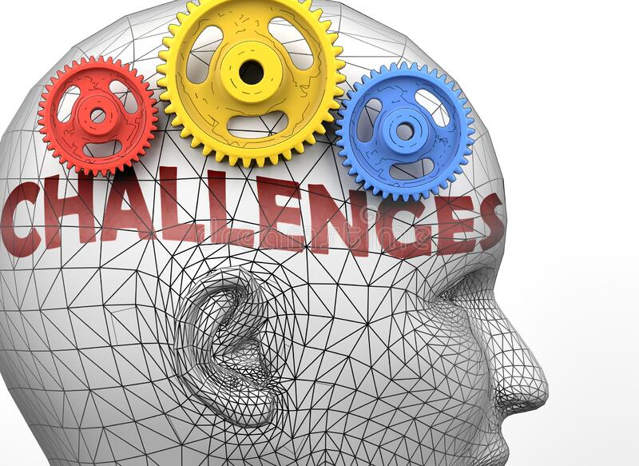

El ser humano siempre está en búsqueda en mayor o menor medida de nuevos retos. La mente humana se alimenta de retos, y al igual que ocurre con las personas, existen personas que necesitan una mayor cantidad de retos para poder satisfacer su hambre, y por el contrario, existen otras que viven perfectamente aceptando solo los retos justos para satisfacer sus necesidades básicas.

Como siempre digo, cuando tienes una mente inquieta, el cerebro es tu peor enemigo. Siempre se encuentra haciéndote challenge constantemente, cuestionando lo que parece cerrado, generando dudas en la toma de decisiones, ampliando la red neuronal para imaginar posibles situaciones altamente improbables. 

En esta ocasión me gustaría centrarme en un tipo de retos muy concreto, con los que todos en algún momento de nuestra vida, o carrera profesional, nos hemos encontrado. Son aquellos retos que en un primer momento vemos como algo inalcanzable, según pasa el tiempo nos damos cuenta de que no estábamos equivocados, y cada vez más, nuestra mente nos gana espacio en el ring y empezamos a pensar en tirar la toalla. Son aquellos que tienen un desenlace temeroso, una trama bastante enmarañada en el tiempo. No son retos rápidos en su consecución, no tienen un objetivo claro al 100%. Tienen perspectiva pero bastante confusa al comienzo y sólo caminando el camino podrás ir viendo si el rumbo marcado es el correcto o bien navegas entre dos mares sin un rumbo claro.

Un compañero de trabajo compartió durante un feedback, una de las mejores frases que han podido llegar a mis oídos provocado un cambio en mi mente y por supuesto, un giro de 360º en mi forma de pensar y afrontar este tipo de retos. La frase no tiene nada del otro mundo, posiblemente no generará ningún efecto en vosotros, pero para mí fue algo revelador en aquel momento. 

> Las personas buscamos en el "ya" y su razón de ser, la explicación a todos nuestros problemas, cuando realmente es el "mañana" el que sabe cuando la incógnita será desvelada. 

Como buen ingeniero, esa frase no compilaba ese día, ni ha compilado hasta hace poco tiempo. No existe compilador, ni lenguaje mental que sea capaz de romper el status mental si no estás preparado para afrontar esos retos. Como todo en la vida, cuando eres consciente del significado más profundo de los mensajes y ves cómo aplicarlos a tus problemas, simplemente es constancia, entrenamiento mental y conseguirás entender cómo vencer tu cerebro poco a poco.

Imaginarse el camino (para lo bueno y para lo malo) es otro gran aprendizaje para poder preparar a tu mente antes del combate. Leyendo un libro bélico, mostraban que por mucho que preparaban a los soldados y mandos intermedios para poder usar nuevas armas, ampliar conocimientos sobre el enemigo, mejorar en el campo de tiro, no servía de nada, si no practicaban técnicas de combate haciendo maniobras lo más reales posibles. Esta técnica tiene dos beneficios. El primer beneficio es que sabes como reaccionar aplicando las técnicas específicas aprendidas por separado, pero esta vez aplicándolas todas a la vez en una situación real. La segunda es mucho menos tangible. Consiste en ir preparando a la mente para una situación hipotética y lo más parecido a la realidad y adquirir práctica por experiencia para mejorar resultados. Las personas sabemos hacer las cosas por dos medios, habilidad innata, o aprendizaje y entrenamiento.

Ante problemas siempre dicen que nunca te riendas. Para ello reinventarse es la clave. La vida ideal no existe...haz la tuya lo mejor que puedas. Reinventarse significa cambiar el esquema mental con el que te encuentras cómodo y buscar nuevas formas de pensar, de hacer y de comportarte ante un determinado problema. Soy fiel defensor de la innovación en cualquier faceta de nuestra vida. Generemos nuevas formas de gestionar problemas, nuevas formas de retar a nuestro cerebro para que no se acostumbre a los mismos desenlaces cuando los problemas afloran. Si queremos cambiar algo, debemos cambiar la forma de enfrentarnos a los problemas y/o retos.

Da igual la posición que tengas en una compañía, los retos y los problemas ocurren a cualquier nivel. La diferencia es el calado y la repercusión de las decisiones tomadas en cada uno de los niveles de responsabilidad. Obviamente, las decisiones de mayor calado, requieren un mayor análisis y tiempo de asimilación. Cuando eres capaz de aplicar la regla del "ya" y el "mañana" que he descrito anteriormente, habrás hecho un level-up en tu carrera profesional, sabiendo dejar el tiempo suficiente para madurar decisiones y tomando los riesgos adecuados para cada situación. 

Sin embargo, en cualquier reto siempre existe una fase donde el challenge mental de nuestro cerebro nos pide tirar la toalla. Fases complicadas sobre todo para saber cómo motivarse a uno mismo. A veces las cosas no son como quieres que sean. Otras veces no son cuando quieres que sean. Sin embargo, siempre el fracaso conduce de una forma u otra al éxito. Esto no quiere decir, que fracasemos para poder ver después la luz al reto mental que tenemos. Sería algo absurdo, puesto que el 90% de los fracasos llevan implícito una evaporación de la oportunidad presentada en ese reto. Aquí es donde engancha el "principio de excelencia" que tanto intento seguir constantemente. Intenta hacer todo lo mejor que puedas, sin dejarte nada dentro para intentarlo y si el cerebro nos pide tirar la toalla, nos toca apretar dientes y seguir empujando para conseguir ser excelente en esa tarea. Asumir riesgos, ponernos en situaciones incómodas, perder batallas (pero no guerras) siempre son situaciones mejores que fracasar y perder la oportunidad de aprender como hubiera sido si hubieras dado el 200% de tu capacidad.

> Cuando pienses que no puedes más, que no eres capaz de superar a tu rival, de vencer tus miedos, aprieta los dientes, mira adelante y piensa que al adversario, también le duele y seguramente, le dolerá mucho más si sigues aumentando tu intensidad.

Y por último, el mejor consejo que puedo dar es rodearse de personas que "suman" en tu carrera. Gente sin egos, gente que te conoce bien, que aprecia como eres, y sobre todo, sabe decirte lo bueno cuando es necesario un refuerzo, y sabe darte feedback para que mejores constantemente cuando las cosas no son tan buenas. Para mí es un 70% de la victoria mental. Con el paso de los años, busco este tipo de personas para confiarles mis mayores problemas y/o retos porque lo que recibo supera a ese "consejo rápido" y se fragua en un aprendizaje de valor que me hace mejor persona y/o profesional.
