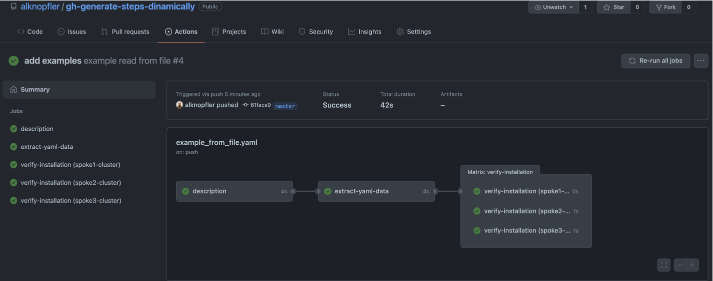

# Introduction - Create steps dinamically



After using 'gh actions' for a while you might feel that the workflows you use are so static, or rather, too boxed in to meet the needs of the project.
With this blog post I would like to show how you can use a 'gh actions' feature called "matrix" to dynamically generate steps based on a variable that we can use to generate different use cases. 

This feature is very useful when you need to repeat a task for different values of a variable and you want to avoid repeating the same code for each of them.
Moreover, if you don't know the number of steps you need, you can use the "matrix" feature to generate them dynamically. 

For instance, imagine that you have a kubernetes cluster and you need to create some steps for each output of the command. For example, you need to validate if the public routes are accessible, or you need to verify the status of some pods/svc/deployments, but you don't know the number of resources you have previously. 


In this post I will show you the next use case: 

- **Create steps dinamically based on a yaml file**
    - If you have a yaml file with a list of items (in our case will be clusters names) you can use the "matrix" feature to generate steps for each of them to show the name.


To prepare the example, I've created a repo with all the files needed to run the  use case:

- **Repository**: [gh-actions-create-steps-dinamically](https://github.com/alknopfler/gh-generate-steps-dinamically)


# Create steps dinamically based on a yaml file

Imagine we have a yaml file with a list of clusters with some information about them:

```yaml
config:
  clusterimageset: openshift-v4.9.0
spokes:
  - spoke1-cluster:
      master0:
        data: "spoke1 - master 0"
      master1:
        data: "spoke1 - master 1"
      master2:
        data: "spoke1 - master 2"
  - spoke2-cluster:
      master0:
        data: "spoke2 - master 0"
      master1:
        data: "spoke2 - master 1"
      master2:
        data: "spoke2 - master 2"
  - spoke3-cluster:
      master0:
        data: "spoke3 - master 0"
      master1:
        data: "spoke3 - master 1"
      master2:
        data: "spoke3 - master 2"
```

The idea is create a step for each cluster and show the name of the cluster in the step name. This is a basic example, because I want just to show how to use the "matrix" feature. With this information, you could extend the example to use the yaml file information to create new tasks inside the step generated dinamically. I will just show the name of the cluster in the step name. 

To use the matrix feature we need to create a yaml file inside the directory `.github/workflows` to create a new workflow:

```yaml
name: example read from file
on:
  push:
    branches:
      - master

jobs:
  description:
    runs-on: ubuntu-latest 
    steps:
      - uses: actions/checkout@v2 # create a checkout (pull repository) in the runner working_dir (usually _work)
      - run: git pull origin ${GITHUB_REF##*/}

      - name: Description
        run: echo "This is an example to generate steps dinamically based on a yaml file. For each line we will create a step in the pipeline dinamically "
```

As you can see I'm adding the first step just to show the example description. It's not necesary, but it's useful to know what we're gonna do in the example.

The next thing is create a new job to extract the information from the yaml file and create the output to fill in the matrix with the data extracted.

```yaml
extract-yaml-data:
    needs:
      - description
    runs-on: ubuntu-latest
    outputs:
      myitems: ${{ steps.data.outputs.myitems }}
    steps:
      - uses: actions/checkout@v2 # create a checkout (pull repository) in the runner working_dir (usually _work)
      - run: git pull origin ${GITHUB_REF##*/}
      - name: Extract data from yaml file
        id: data
        run: |
          cd ${GITHUB_WORKSPACE}
          echo "::set-output name=myitems::$(cat ./config.yaml | yq e '.spokes.[] | keys | join(",")' - | jq -Rsc '. / "\n" - [""]')"

```

As you can see, I'm creating three important things:
- An Output named `myitems` which contains the information extracted from the id `data` with the variable name `myitems`. So we need to define an step named `data`and create a output named `myitems`to fill in the variable data.

- The step with id `data` which contains the `myitems`output variable and the command to extract such information.

- The command in this case is a `cat` command and some pipes to filter the information from the yaml file. Basically I'm gonna extract the cluster name from the yaml file.

With this information, I'm ready to use the matrix feature to generate the steps dinamically using this snip of code:

```yaml
verify-installation:
    needs: extract-yaml-data
    runs-on: ubuntu-latest
    strategy:
      matrix:
        mymatrix: ${{ fromJSON(needs.extract-yaml-data.outputs.myitems) }}
    steps:
      - name: ${{ matrix.mymatrix }}
        run: |
          echo "Do something with ... ${{ matrix.mymatrix }}, for example verify the installation of each cluster"     
```

In this job I'm going to verify the installation of the cluster (simulating the verification because we just have an echo command), creating several steps. The number of steps created will be readed using `mymatrix` and reading the information from the step `data` using the previous job `extract-yaml-data`. In this case, the output we want to use is `myitems` that contains the information extracted from the yaml file as I described before.

The result of this job will be a workflow with 3 steps generated dinamically for each cluster name: 


# References:

- **Repository**: [gh-actions-create-steps-dinamically](https://github.com/alknopfler/gh-generate-steps-dinamically)