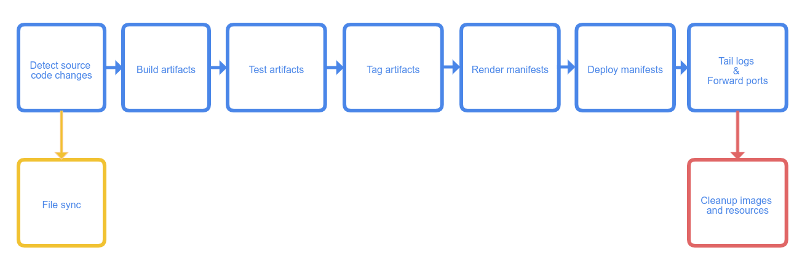

# Introduction - Debug k8s applications on the fly

Nowadays, the development of applications on kubernetes is something that any developer will surely use in their work. However, to be honest, I have detected real problems debugging applications or operators that run on kubernetes, usually resorting to ineffective methods to discover bugs during the debug phase.

Imagine that you have a kubernetes operator that you want to debug because the reconciliation process is not working properly, or the operator is not working as expected. You have a kubernetes cluster running on your local machine, and trying to debug it, you decide to deploy the operator on this local cluster in order to verify what's happening in your production k8s cluster. 

At this point, in local you have a pair of possibilities to debug it:

- Write some code to debug the operator, build the new debug image, and deploy it on the local cluster to verify the prints and logs.
- Use a debugger on the fly to verify the reconciliation process creating new breakpoint to look for the expected behavior.

In this post, I will show you how to do this **using a debugger on the fly with k8s**, but let's first analyze and explain the basics of both methods to understand how to debug on the fly using other tools. 

## Debugging using prints prints

This is the simplest way to deploy and debug an application or operator on the fly. The process is pretty simple for developers. You just need to identify the hot points in the code, and prints the information you want to debug. Piece of cake! 

The problem in this case is the time that you need to build a new image to debug each try you want to print some new information, and for sure, you need to deploy to your cluster before testing it. 

For example, with the reconcile loops of complex operators (over 1k lines per reconcile loop) could be difficult print exactly the information you need, so maybe it could take you several tries until you get the issue located and you can debug it.

Definitely you need to be careful with the prints, because you can easily miss the hot points and you will miss the information you need. It could be traslated to time, saying that the time you need to use this method is high if you don't have a good understanding of the code.


## Debugging on the fly on the fly

This method consists in the use of classical debuggers in order to have the information as fast as possible to understand the issues, but in this time, running on the remote server (maybe on a previous environment, quite similar to the production) and creating the images at the same time you're fixing the code to deploying the operator again and again reducing the time waiting for.

Just to be clear, the principles of this methods are:

- Running remotely (maybe previous/stage environments)
- Debug using a debugger (go dlv in our case to run it remotely)
- Build and deploy the images automatically at the same time you're keeping the debuggers running.
  

# Setting the environment

This section will show you how to set the environment and tools that you will need to debug the k8s application or maybe an operator on the fly. 
  
## Environment Description 
  For this post, I will use a kubernetes cluster running remotely on another server, so basically I will use a vscode plugging to run everything remotely, but let's see first the basics of the environment:

  - **Laptop**: Mac OS X Big Sur 11.6
      - vscode + plugins
  
   This is my laptop with vscode installed, but without docker, kubectl and so on. Just with vscode. No need to install anything else. 
   
  - **Server (hostname alkmini)**: Linux Fedora 5.11.8-200.fc33.x86_64
      - SSH server
      - Docker daemon running
      - Kubectl / oc 
      - dlv  (which is the debugger for golang)
      - Kubernetes cluster running (in my case using minikube just for this post example)
  
  This is the remote server with SSH access, Docker daemon, kubectl, dlv and the Minikube cluster k8s installed and running. In other cases could be the previous environment k8s cluster, or a local k8s cluster, actually whatever you want.
  The important thing here is that **in the remote server you don't need anything regarding the vscode editor**.


## VSCODE pluggins and tools

First, I will install the next vscode plugins that will allow me to run everything remotely:

### **Remote - SSH**
**Description**: Remote - SSH: This plugin allow us use our Laptop VScode to work in a remote server exactly like we use it in our local machine. It uses ssh to connect to the remote server and run commands as well as use our plugins there.

**Configuration**: As you can see, you could add your remote server and open a folder like a workspace to start working remotely. Just add your host info, and ensure you have ssh access to the host directly (added ssh key previously). Then you could navigate looking for the folder you want to add as you can see in the next picture:


Once connected, basically, you will notice you're working remotely looking at the bottom this host:


At this point, everything will be executed in the remote server using our Laptop VScode editor.
Take care of the plugins you install in the remote server, because are different than the local one. It's something rare at the beginning but with this feature you could have only a subset of plugins installed in your remote server instead of all your local vscode set of plugins.  

**Link**: [ms-vscode-remote.remote-ssh](https://marketplace.visualstudio.com/items?itemName=ms-vscode-remote.remote-ssh)


### **cloud code kubernetes**

**Description**: Cloud Code works with Google’s command-line container tools like skaffold, minikube and kubectl under the hood, providing local, continuous feedback on your project as you build, edit, run and deploy your applications locally or in the cloud. It was thought to be used with google cloud platform (gcp) but it could be used with any local kubernetes cluster. This is our use case. We're gonna use it with our k8s (minikube) cluster.


**Link**: [cloud code](https://marketplace.visualstudio.com/items?itemName=GoogleCloudTools.cloudcode)
**NOTE**: There is a [bug](https://github.com/GoogleCloudPlatform/cloud-code-vscode/issues/486) in the latest version so you need to install previous one: **Version 1.14.1 (Sept 2021)**


### **Delve**

**Description**
Delve (dlv) is the debugger for the Go programming language. The goal of the project is to provide a simple, full featured debugging tool for Go. Delve should be easy to invoke and easy to use. Chances are if you're using a debugger, things aren't going your way. With that in mind, Delve should stay out of your way as much as possible.

The idea is install it on your remote server and keep it running to debug from your local using the vscode editor and the remote - ssh plugin). So basically, from your laptop using vscode with the remote plugin installed, you could run the debugger on the remote server and debug the application running on the remote server.

```bash
$ git clone https://github.com/go-delve/delve
$ cd delve
$ go install github.com/go-delve/delve/cmd/dlv
```
**Link**: [delve](https://github.com/go-delve/delve/tree/master/Documentation/installation)


# Configuration 

In this section I'm gonna create an example end-to-end to explain step by step the process. First, I will show you the repository and the configurations we have to do in order to debug the k8s application on the fly.

## Repository

To explain the process, I'm gonna use the next repository:
[https://github.com/alknopfler/go-remote-debug-delve.git](https://github.com/alknopfler/go-remote-debug-delve.git)

The content of this repository is the following:
```
alknopfler:alkmini : ~/projects/src/github.com/alknopfler/go-remote-debug-delve {master} 
$ tree .
.
|-- .vscode
|   |-- settings.json
|   |-- launch.json
├── docker
│   └── debug
│       └── Dockerfile
├── go.mod
├── k8s
│   └── deployment.yml
├── main.go
├── Makefile
├── README.md
└── skaffold.yaml

```

As you can see, the repository is structured as follows:

 - Docker folder: with the Dockerfile to generate the image which will be push to quay.io registry
 - K8S folder: which contains basically the application deployment manifest to be deployed
 - Main.go: the main file of the application

Now we've got 2 special files which allow us to build, deploy and debug the application:

 - Skaffold.yaml: this is the configuration file to build, deploy and debug the application
 - .vscode/launch.json: this is the configuration for the cloud code plugin

I'm gonna get into the cloud code configuration in order to explain a little bit the options we have to configure, and then, move on with our scenario to configure skaffold after that. 

## cloud code configuration

First thing is open the file `.vscode/launch.json` and you will add new configuration:


as you can see, there are 2 options which I'm gonna use in this example:

- **Attach to kubernetes Pod (Go)**: Used to attach to a running pod in the kubernetes cluster in order to debug it. You could set breakpoint in code and using it, if the image has been built with Dlv (debugger) installed, you could debug the application attaching to this port.

```yaml
{
            "name": "Attach to Kubernetes Pod (Go)",
            "type": "cloudcode.kubernetes",
            "request": "attach",
            "language": "Go",
            "debugPort": 40000,
            "podSelector": {
                "app": "server-debug"
            },
            "localRoot": "${workspaceFolder}",
            "remotePath": "",
            "remoteRoot": "/"
}
```

As you can see, with the pod selector, and the port, we could attach to the pod in the kubernetes cluster. If you want to debug, you need to ensure that the remotePath and remoteRoot are well configured. If you make a mistake here, you could attach to the pod but not debug it, because the breakpoint will be "unverified".

- **Kubernetes: Run/Debug Go: 

```yaml
{
            "name": "Kubernetes: Run/Debug",
            "type": "cloudcode.kubernetes",
            "request": "launch",
            "autoStop": false,
            "skaffoldConfig": "${workspaceFolder}/skaffold.yaml",
            "watch": true,
            "cleanUp": true,
            "portForward": true,
            "imageRegistry": "quay.io",
            "debug": [
                {
                    "image": "quay.io/amorgant/server-debug",
                    "containerName": "server-debug",
                    "sourceFileMap": {
                        "${workspaceFolder}": ""
                    }
                }
            ]
        },
```
There are some points important to be explained here:

 - **autoStop**: if you set this to true, the debug session will be automatically stopped when the application is stopped.
 - **SkaffoldConfig**: this is the configuration file to build, deploy and debug the application we will see in the next section
 - **watch**: This is the most important option to debug on the fly. Using this option, we could debug watching changes in code in order to build, and deploy automatically to debug it without stop the debugger. Skaffold will be responsible, to build, deploy the new image while we're working on the code. It's not a real time, because the build step take some time, but the advantage is that you could debug the application without stop the debugger. Also, if you have the "auto-save" option, this process will be constantly running, so you could debug the application without stop the debugger.
 - **cleanUp**: This is the option to be clean with our session ;) It will destroy the containers and images created by skaffold after stopping the debugger.
 - **portForward**: This is the option to be able to make a port forward to our local environment.
 - **debug/image**: this is the image we're going to build with the debugger dlv installed.
 


So as you can imagine, with this option as well as the attach to kubernetes pod option, we're able to debug a running pod, and if we change something in code, skaffold will build, deploy the new image to continue the debugging step. 
The combination of both option is the magic to debug on the fly k8s applications or operators.

Let's see the skaffold configuration to see the options we could use:

## skaffold configuration

[Skaffold](https://skaffold.dev/docs/pipeline-stages/) is a very interesting tool in order to build, deploy your application directly using cloud code plugin. You don't need to install anything else. Just copy the manifest in order to create a pipeline for your application and just run the cloud-code plugin to use it.

Just as a reference you could see the pipeline steps you could use with skaffold:



I'm gonna show you the configuration file we're going to use in this example, and then, I will show you some other interesting options to keep in mind if you need something else for your environment:

```yaml
apiVersion: skaffold/v2beta19
kind: Config
build:
  artifacts:
  - image: quay.io/amorgant/server-debug
    buildpacks:
      builder: gcr.io/buildpacks/builder:v1
    context: .
    sync: 
      auto: true 
  local:
    push: true
deploy:
  kubectl:
    manifests:
    - k8s/deployment.yml
```
Let's get into the manifest in order to discover the options we are going to use:
In our case from the reference pipeline, we are going to use 2 steps:

- **Build**: This is the step to build the image. Skaffold supports as [builders](https://skaffold.dev/docs/pipeline-stages/builders/) -> Dockerfile, Maven, Buildpacks, and custom scripts. 

In our case, we're going to use buildpacks which detects automatically your Dockerfile to build it:
```yaml
    buildpacks:  
      builder: gcr.io/buildpacks/builder:v1
```
But, for a complex project where build step has a very complex Makefile you could use something like this:

```yaml
buildpacks:
 custom:
      buildCommand: |
        sudo -S skipper make update-debug-minimal
        docker tag quay.io/ocpmetal/assisted-service:latest quay.io/amorgant/assisted-service:latest
        docker push quay.io/amorgant/assisted-service:latest
        sudo -S skipper make deploy-all
```

Also, you could use Dockerfile as builder to build using your Dockerfile spec like this:

```yaml
  docker:
    dockerfile: deploy/Dockerfile
```

- **Deploy**: This is the step to deploy the image to the kubernetes cluster. Skaffold supports as [deployers](https://skaffold.dev/docs/pipeline-stages/deployers/) -> Kubernetes, Helm, Kustomize and docker.


## Dockerfile configuration to debug

To debug I need to build the image using dlv in order to install it and use it to run the application through dlv command entreypoint:

```Dockerfile
FROM golang:1.16 AS build
WORKDIR /
COPY . .
RUN CGO_ENABLED=0 go get -ldflags "-s -w -extldflags '-static'" github.com/go-delve/delve/cmd/dlv
RUN CGO_ENABLED=0 go build -gcflags "all=-N -l" -o ./app

FROM alpine
WORKDIR /
COPY . .
COPY --from=build /go/bin/dlv dlv
COPY --from=build /app app
ENTRYPOINT [ "/dlv" , "--listen=:40000", "--headless=true", "--api-version=2", "--accept-multiclient", "exec", "/app"]]
```
As you can see the entrypoint launch the application using dlv command in oder to be debugged in the remote server.


## k8s deployment

This is a basic deployment for the k8s application. It's just a simple deployment with a single container using the image we've just built:

```yaml
apiVersion: apps/v1
kind: Deployment
metadata:
  name: server-debug
spec:
  selector:
    matchLabels:
      app: server-debug
  template:
    metadata:
      labels:
        app: server-debug
    spec:
      containers:
      - name: server-debug
        image: quay.io/amorgant/server-debug
        imagePullPolicy: Always
        resources:
          requests:
            memory: "128Mi"
            cpu: "100m"
          limits:
            memory: "256Mi"
            cpu: "500m"
        ports:
        - containerPort: 8080
```


# Demo on the fly

Once we have all the configuration ready, the next thing is go to the plugin cloud code and follow the next steps:

- Verify the cluster is ready and you can get access to its resources from vscode and cloud code plugin:


- Set the breakpoint in the code:


- Click on the debug on kubernetes button to start the process


and the next one is to start the process to debug:


if you want to see complete there is a video to show the full process you can see here:

[](https://www.youtube.com/watch?v=d-P5wCdCwrQ)


# Limitation and bugs
- cloud code: There is a [bug](https://github.com/GoogleCloudPlatform/cloud-code-vscode/issues/486) in the latest version so you need to install previous one: **Version 1.14.1 (Sept 2021)**
- To make it work, you need copy the project inside the Dockerfile because the debugger needs the stack to know which is the trace to debug it. you could use:
```
WORKDIR /
COPY . .
```


# References

## Links

  VScode Remote Explorer: [ms-vscode-remote.remote-ssh](https://marketplace.visualstudio.com/items?itemName=ms-vscode-remote.remote-ssh)

  Cloud Code: [cloud code](https://marketplace.visualstudio.com/items?itemName=GoogleCloudTools.cloudcode)

  Delve Go debugger: [delve](https://github.com/go-delve/delve/tree/master/Documentation/installation)  

  Skaffold builders: [builders](https://skaffold.dev/docs/pipeline-stages/builders/)
  
  Full Video: [video](https://www.youtube.com/watch?v=d-P5wCdCwrQ)


## Thanks
- Special thanks to [@dchavero](https://github.com/danielchg) for the help with the configuration of the environment.
- Thanks also to antelman107/go-remote-debug-delve to the original repo which make me thing about this to create this post.
