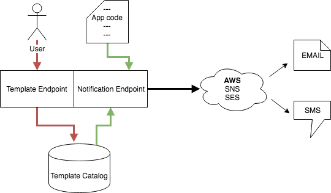

The [notificationApp](https://github.com/alknopfler/notificationapp) is an open source project based on Go in order to send notifications by different channels (by email, sms, etc...) using the AWS SNS and AWS SES services. One of the main features of the project, is the possibility to create templates based on places holders (for instance, {{.CustomData.Name}}) and store that template in the database to be used after that by the notification endpoint.

Created by Alknopfler in [https://github.com/alknopfler/notificationapp](https://github.com/alknopfler/notificationapp)

## [](https://github.com/alknopfler/notificationapp#features)Features

- Templates based on places holder {{.CustomData.XXXX}}
- Templates Management (Create, Retrieve, and Delete)
- Templates store based on 3 params:
    - Template Id
    - Channel (sms, email, and so on...)
    - Language
- Multi-channel and Multi-recipient features (The NotificationsApp is able to send to severals users with different channels) Send Notifications to users using SNS and SES services (AWS services)
- Custom the message using Custom Data values to replace in the template placesholder
- API to use all the features

## [](https://github.com/alknopfler/notificationapp#architecture)Architecture

[](https://github.com/alknopfler/notificationapp/blob/master/notificationapp.png)

## [](https://github.com/alknopfler/notificationapp#how-to-use)How to use

There're two endpoints:

- Template endpoint in order to manage the different templates
- Notification endpoint to send notifications

## [](https://github.com/alknopfler/notificationapp#store-a-new-template)Store a new Template

This part of the API offer the possibility of create, delete and get the templates available to send notifications

### [](https://github.com/alknopfler/notificationapp#api)API:

[http://notification-app:8080/templates](http://notification-app:8080/templates)

```json
- Method: POST
- Json example:

    ```
    {
    "TemplateId": "template1",
    "Channel": "Email",
    "Lang": "ES",
    "Content": "<html><head></head><body> Hola {{.CustomData.Name}}, Gracias por contratar {{.CustomData.ItemName}}.<br><br>Pulse <a href={{.CustomData.ActivationLink}}>aquí</a> para activar de su cuenta </body></html>"
    }
    ```
```

[http://notification-app:8080/templates/{templateID}](http://notification-app:8080/templates/%7BtemplateID%7D)

```json
- Method: GET | DELETE
- Json response:

    ```
    [
        {
            "Template": "template1",
            "Content": "<html><head></head><body> Hola {{.CustomData.Name}}, Gracias por contratar {{.CustomData.ItemName}}.<br><br>Pulse <a href={{.CustomData.ActivationLink}}>aquí</a> para activar de su cuenta </body></html>"
        }
    ]
    ``` 
```

As you can see, the template key store in mongo will be the concatenation of:

- TemplateType
- Channel
- Language

### [](https://github.com/alknopfler/notificationapp#send-notification-flow-description)Send Notification (Flow Description)

The main points will be:

- First, any microservice could generate the Notification Message json:

[http://notification-app:8080/notifications](http://notification-app:8080/notifications)

```json
{
"AccountId":"evento1",     
"Subject":"Sending mail",    
"Recipient":["albertoxxxxx@mail.es","22222222"],
"TemplateType":"template1",
"Channel":{
    "Email": true
},
"Language": "EN",
"CustomData":{
    "Name":     "Peter",
    "ItemName": "Product1",
    "ActivationLink": "http://www.google.es"
}
}
```

In that case the translation of this message to human language should be:

### [](https://github.com/alknopfler/notificationapp#account-id)Account Id:

Represent an identificator for the message

### [](https://github.com/alknopfler/notificationapp#subject)Subject:

Represent the subject for the email

### [](https://github.com/alknopfler/notificationapp#recipient)Recipient:

The list of recipient to send the notification. Could be different type of recipient (email, sms, etc..) but in that case, the notification sent will be just the available if match with the channel. In the example, the notification will not be sent to the telephone number as sms, because the channel is one of the list to send the notification

### [](https://github.com/alknopfler/notificationapp#templatetype)TemplateType:

This is the name of the template loaded previously

### [](https://github.com/alknopfler/notificationapp#channel)Channel:

This is the way to specify the channel or channels to use in the notification (By default if a available channel not appear here, the value will be False. In the example, the sms channel will not be available)

### [](https://github.com/alknopfler/notificationapp#language)Language:

This is the language for the notification. If there are several templates available for a notification, with the language will be select the correct one.

### [](https://github.com/alknopfler/notificationapp#custom-data)Custom data:

This is the value of the variables in order to be matched into the {{.CustomData.XXXX}} templates placesholder

## [](https://github.com/alknopfler/notificationapp#build)Build

```shell
docker-compose -d up .
```

## [](https://github.com/alknopfler/notificationapp#testing)Testing:

Need the special environment var in order to mock the mongo and email channel:

```shell
MOCK=MOCK
```
