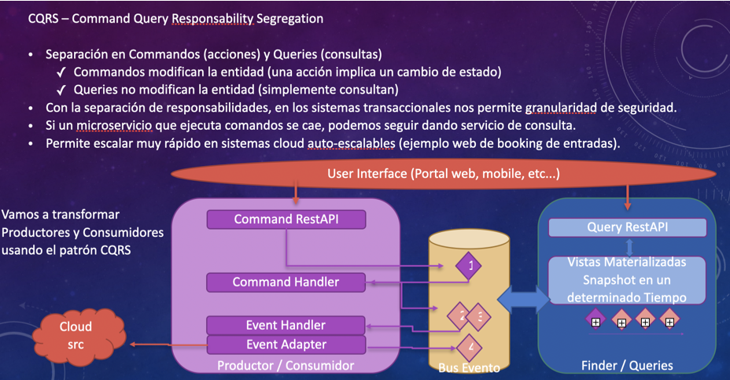

+++
title = "UPM - Microservice Conference 2021"
description = "Talk about Microservices at Universidad Politecnica de Madrid "
date = "2021-01-16"
aliases = ["talks", "microservices", "conference", "conferences", "speaker"]
author = "Alknopfler"
+++

I attended as a teacher in the Conference about Microservices in Madrid 2021, doing a presentation in the Polytechnic University of Madrid.

