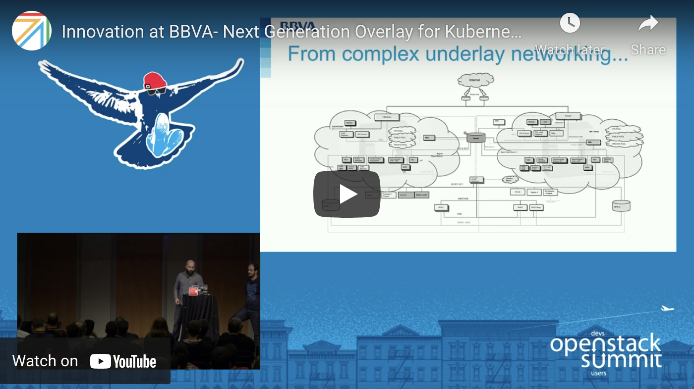

+++
title = "Summit Openstack Barcelona 2016"
description = "Talk Openstack Barcelona Submmit 2016"
date = "2016-01-01"
aliases = ["talks", "summit", "videos", "conferences", "speaker"]
author = "Alknopfler"
+++

I attended as a speaker in the Openstack Barcelona Summit in 2016 doing a presentation about Openstack based in containers on top of Kubernetes.

Also, we did a real life demo creating all the stack during the talk:

