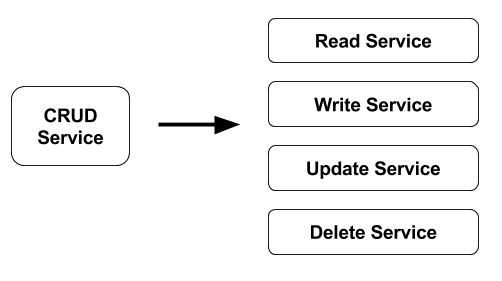
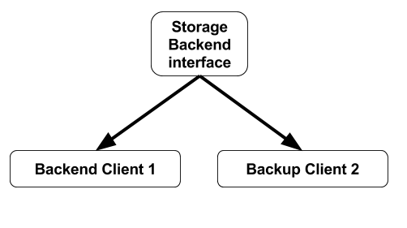

During my professional career, I've been working with microservices for a long time, and I would like to share with you the experiences and knowledge that I've learnt working with them.

At the beginning, the first contact with microservice is like a piece of cake, but when you are getting deep under the hood, sometimes, you will be able to find some commons problems that you could solve just preparing your mind, your application and your infrastructure to be successfull in your tasks.

> The first point to keep in mind when you're working with microservices is **Single Responsibility Principle.** 

This sentence means that you must to define services as smaller as possible  from a funtional point of view. **Just do what you have to do!!!** Sometimes, this sentence could be easy to understand, but also, it's easy to forget when you're developing or thinking your microservice's architecture.

How do I solve this problem? I'm always thinking if any piece of the architecture makes sense to be separated into small pieces. Moreover, during the design phase,

you should not look the number of containers that you will have to manage during the implementation phase. This is the most common error in this phase. The mind is your worst enemy.

> Another point to keep in mind should be the **Resilient/Flexible Design**

As you can imagine, using the picture shown before, if we have a failure in the Delete Service, the other ones, will be still available. This is a very important thing with high scaled design architectures.

My 5 cents!!! If you're thinking to be flexible in the application design, you should think the way to plug new features. You have to prepare your application to be adapted using interfaces to add new features in the future without headaches. It does not mean that every module should be an interface, but you have to prepare the application to be pluggable in case you need it.

> Scalability is another important key when you use microservices.

For sure, the scalability is one of the most important problem that you're going to find while you're using microservices. The people says that you have to do stateless services in order to scale-out without problems. Obviously, it's true! But also, you have to prepare the containers in order to be scaled without any problem. I mean, if you get a 2GB container, and you would like to scale it out, you're going to be in trouble in all situations (with stateless services or not). The idea of stateless has to be completed with the minimun container size. My recomendation: I'm always trying to use low-size images like alpine, as well as application done by modern languages without virtual machine embeded (you know!...) With alpine you'll get a 20Mb image so the time to scale-out the service should be ridiculious into a PaaS.

> Using Microservices, you will get independency in your designs. Low impact between services. Also, you could choose different technologies, as well as you'll get less dependencies between services.

Everything all'right!!! But...

What's happen if you change one technology, and obviously, there are API changes? You have to change most of the components which use the old API. It's doesn't matter...Imagine the situation with monolithics apps!!!

Obviously, due to have more small services, all of the containers should be deployed into a PaaS, or K8S o similar,  in order to have service discovery, and other basic development features.

Regarding to my experience, the best comment that I could say in this point, could be that you have to design the networking connection between containers correctly, in order to reduce the time to deploy and run your application. I mean, you have to prepare the service discovery between microservices, and also, establish all the features to get information between containers (for instance, the shared storage between containers)

If you are looking for the disadvantages that I know, as you can imagine, there are few disadvantages, but I have to be honest at this point.

From my point of view, although you use orchestration containers services like kubernetes, mesos, swarm, rancher, openshift, and so on... If you have a large number of containers to deploy, you will have more possibilities to fail deploying these containers, but also, the failures are more located inside small parts of code.

Moreover, people says that if you're not an experimented developer, sometimes you could feel overloaded reading the microservices code. In my opinion, it's not a disadvantage, I think if you read just a self-contained functionality piece of code, it's easier than read a monolithic service.
