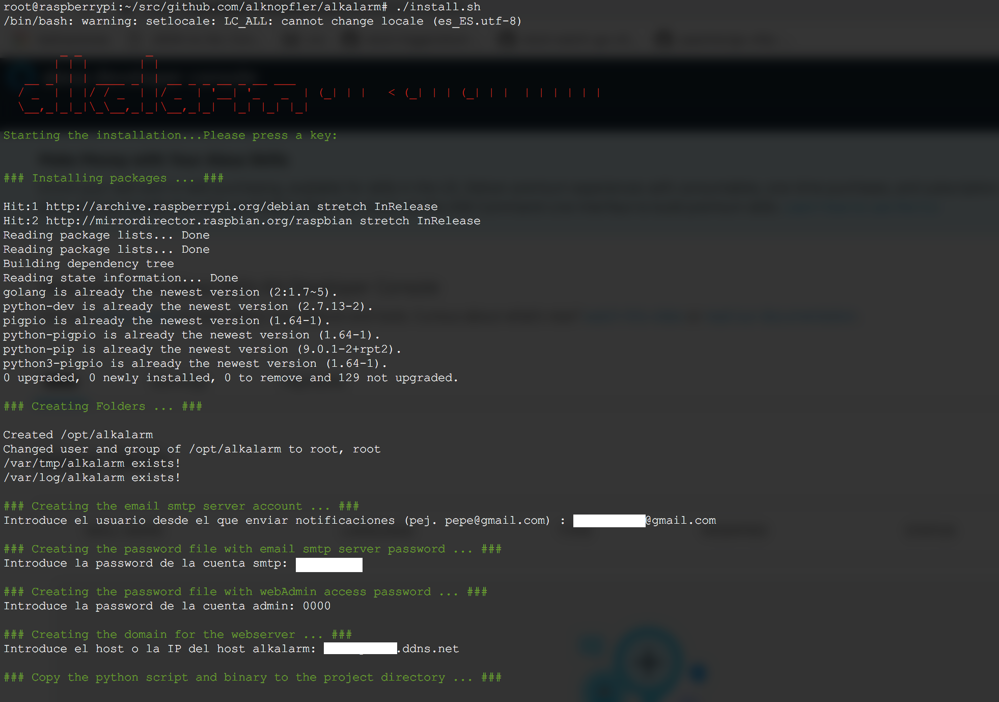

**AlkAlarm** is a open source project created to get ready a home Alarm System in few minutes using Golang. In the market you will buy a home system alarm based on 433Mhz sensors and using GSM modules to send the notifications like: 

The main idea of this project is based on the same kind of Alarm GSM systems, but in this case, we only have to buy the sensors and sirens, because:

- the main controller, and gsm module will be made with the **raspberry** (physically)
- the **AlkAlarm** code of this repo will be installed on raspberry and it will be the brain of raspberry Alarm System
- Sensor bought will be **generic 433Mhz** and will be added to the raspberry using a 433mhz receptor.
- **Notifications** will be send by email to get it free, and wired/wireless sirens will be connected to Raspberry.
- **WebServer**, **API server**, and **Android APP** will be available to communicate with the Alarm System.

### Main Features

- Interface with the generic 433Mhz security sensors in order to register into the system.
- Detect sensor events registered previously and trigger the notifications actions.
- Operate with remote controllers at the same level than the webserver, api server and android app.
- Webserver, API and Android APP integration for management the system.
- Notifications by email (without any limit) and triggering sirens connected to the system.
- Basic Auth in all the operations using Access Code
- Discovering the 433Mhz sensors to add new sensors in the future
- Zones in order to separate the sensor in rooms

 

### Physical connections & Architecture

The connection between the Raspberry PI and the 433Mhz receptor has been followed from this blog:

- [Link1](http://rsppi.blogspot.com.es/2013/08/comunicacion-por-rf-433mhz-desde.html)
- [Link2](https://www.princetronics.com/how-to-read-433-mhz-codes-w-raspberry-pi-433-mhz-receiver/)

The physical connection as you can see is pretty easy and cheap if you have a Raspberry PI at home. Just buying the receptor and a pair of cables you could connect by yourself: 

In our case, we're going to use the pin:

> **Physical pin 13**

> **BCM pin 27**

> Wiring Pi pin 2

> BCM pin 21 on Rev 1 ( very early ) Pi

Into the \_433.py script we should check it out in order to see it at the end of the script:

> **RX=27**

If you want to change for another one you have to change the \_433.py script also.

In order to learn a little bit more about GPIO ports in Raspberry PI you could visit the next interactive web to discover more about all the GPIO ports:

- [GPIO Ports RaspberryPI](https://pinout.xyz/pinout/pin13_gpio27)

Regarding the physical installation of AlkAlarm system, the idea is try to cover your home sites with 433Mhz generic sensors (PIR, doors, hum, etc..) and connect them to the AlkAlarm System in order to be detected by the Raspberry with Alkalarm software installed. For instance, you could draw your house and the collocation of them keeping in mind that maybe 12-15m of distance will be far enough to be detected by the receptor.

### Logical Architecture

Using the RaspberryPI we are going to simulate the main controller for the commercial Alarm Systems. The project will be separate in the next parts:

- The External **433Mhz Sensors** & Internal RaspberryPI **433Mhz receptor**
- The **Database (Sqlite3)**
- The **WebServer** listening on :80 based on Javascript and HTML static files
- The **API Server** listening on :8080 based on Golang Gorilla
- The **433Mhz.py daemon** in order to discover the sensor events
- The **DiscoverCodes** utility based on the 433Mhz.py daemon like an external utility to add new sensors in the future
- Also, the **Android app** is out of the scope of this project, but obviously, you could create easily using the WebServer and an online app android generator.

### Installation

You can clone the Git project with the following command:

`git clone https://github.com/alknopfler/alkalarm.git`

This will download the latest version of the project into a folder with the name alkalarm (you can define this folder as additional argument to the git clone e.g.: git clone ). This won't be the final installation location, so you can clone it, for example, in your home directory.

If you don't have git installed you can install it using your distributions package manager (e.g.: on Raspbian apt-get install git).

#### Directories and functions

The distribution of directories and the meaning of all of them inside the project:

- `./api/`: This is the main directory for the API server listening in :8080
- `./webinterface/`: This directory contains the web inteface files. There are static files, style css files, and javascript files
- `./scripts/`: This is an auxiliary directory with the discoverCode script in order to discover new sensors/controllers
- `./examples/`: This dir contains the Json examples in order to register new sensors, control, mail, as well as the curl command to do that directly using the API server.
- `./config/`: This directory contains the main configuration and the database schemes and tables creation command.
- Main Modules:
    - `./alarms/`: This directory contains the functions to create, delete and query all the alarms registered once triggered by a sensor.
    - `./control/`: This directory contains the functions to create, delete, and query the remote controllers
    - `./database/`: This directory contains the operation with the database. This one will be called by the other modules.
    - `./kernel/`: This is the main directory that contains the alarm algorithm as well as the notification functions used by the system.
    - `./mailer/`: This directory contains the functions to be able to send emails
    - `./sensors/`: This directory contains the functions to create, delete and query all the sensores available.
    - `./states/`: This directory contains all the functions to operate with the global state for the alarm system.

Into the main folder you could find:

- `./install.sh`: Installation script (the first point of contact to create a new installation)
- `./alkalarm.go`: This is the main alkalarm exec go program integrated with systemd:
    - `./alkalarm`: Exec binary which will be executed by systemd after the installation phase
    - `./alkalarm.service`: This is the systemd file to convert into a system daemon
    - `./alkalarm-webserver.service`: This is the systemd file to convert the webserver into a system daemon
- `./30-alkalarm.conf`: Rsyslog config file to redirect all events to a specific file with logrotate feature included.
- `./_433.py`: This is the python file which will be dedicated to snif the new codes into the alarm system.

#### Installation process

After clonning the project you could run the install.sh script:

`@raspberrypi:~/alkalarm# ./install.sh`

The script will cover the next steps:

1. Installing package and dependencies. You don't have to keep in mind nothing else
2. Creating the folders for the project (/opt/alkalarm by default)
3. Copy the python script and the binary
4. Installing the web server and copy the binary to the project directory
5. Installing the alarm binary and copy it to hte project directory
6. Configure the SMTP account and password in order to send the notifications by email. Also you have to configure the access password required in the webserver.
7. Enabling the systemd services for all modules implicated
8. Configure the log system.
9. Starting all the services. After all steps, you should have access to:

****

**WebInterface**: `http://<localhost/ip/dns>/` API **server**: `http://<localhost/ip/dns>:8080/`

For each component there is a startup script installed under /etc/init.d/. Additionally a service file for Systemd is installed under /etc/systemd/system.

Following three startup scripts are installed (for a complete installation):

`/etc/init.d/alkalarm` : used to start the alarm system

`/etc/init.d/alkalarm-webserver`: used to start the webinterface All scripts support the default service command: start, stop, restart, status

### First Start

After a new install you should start the manager and webinterface first. You will have to do some configuration before you can start the worker.

To start the two service enter the following commands:

`systemctl start alkalarm`

`systemctl start alkalarm-webserver`

 

### API

The next table shows the operations available using the API:

|  |  |  |  |  |
| --- | --- | --- | --- | --- |
| sensors | \[API\] insert | \[API\] select | \[API\] delete | N/A |
| alarm | insert | \[API\] select | \[API\] delete (all) | N/A |
| mail | \[API\] insert | \[API\] select | \[API\] delete | N/A |
| control | \[API\] insert | \[API\] select | \[API\] delete | N/A |
| global | insert | select | N/A | update |

#### Fixed Values

- Sensor: \*TypeOf: "presence|aperture|other"
- Control: \*TypeOf: "full|partial|inactive"

#### Script to detect sensor codes

- Inside of the project there's an interactive script to discover 433Mhz codes to register new sensors into the system.
- The output will be the payload to register new sensors/control to the system.
- The script is able to register several sensors/controls at the same time.
- The script is installed automatically with the installation phase and the route is:`/opt/alkalarm/discoverCode`

#### Operations

- **Create Sensor**
    - **URL:** "/setup/sensor"
    - **METHOD:** POST
    - **PAYLOAD:** `[ { "Code":"234554", "TypeOf":"presence", "Zone": "puerta entrada" }, { "Code":"555555", "TypeOf":"other", "Zone": "tejado" } ]`
- **Get Sensor Info**
    - **URL:** "/setup/sensor"
    - **METHOD:** GET
    - **PAYLOAD:** \`\`
- **Delete Sensor**
    - **URL:** "/setup/sensor/{code}"
    - **METHOD:** DELETE
    - **PAYLOAD:** \`\`
- **Create Control**
    - **URL:** "/setup/control"
    - **METHOD:** POST
    - **PAYLOAD:** `[{"Code":"3462412","Description":"mando1","TypeOf":"inactive"},{"Code":"3462448","Description":"mando1","TypeOf":"full"},{"Code":"3462592","Description":"mando1","TypeOf":"partial"}]`
- **Get Control Info**
    - **URL:** "/setup/control"
    - **METHOD:** GET
    - **PAYLOAD:** \`\`
- **Delete Control**
    - **URL:** "/setup/control/{code}"
    - **METHOD:** DELETE
    - **PAYLOAD:** \`\`
- **Create Mail**
    - **URL:** "/setup/mail"
    - **METHOD:** POST
    - **PAYLOAD:** `[ { "receptor":"xxxxx@gmail.com" }]`
- **Get Mail Info**
    - **URL:** "/setup/mail"
    - **METHOD:** GET
    - **PAYLOAD:** \`\`
- **Delete Mail**
    - **URL:** "/setup/mail/{receptor}"
    - **METHOD:** DELETE
    - **PAYLOAD:** \`\`
- **Get Alarm Info**
    - **URL:** "/alarm"
    - **METHOD:** GET
    - **PAYLOAD:** \`\`
- **Delete all the Alarm**
    - **URL:** "/alarm"
    - **METHOD:** DELETE
    - **PAYLOAD:** \`\`
- **Activate all the Alarm Sensors**
    - **URL:** "/activate/full"
    - **METHOD:** POST
    - **PAYLOAD:** \`\`
- **Activate part of the Alarm Sensors**
    - **URL:** "/activate/full"
    - **METHOD:** POST
    - **PAYLOAD:** \`\`
- **Stop the Alarm System**
    - **URL:** "/deactivate"
    - **METHOD:** POST
    - **PAYLOAD:** \`\`
- **Status the Alarm System**
    - **URL:** "/status"
    - **METHOD:** GET
    - **PAYLOAD:** \`\`

All the features available by the api are also available with the WebServer.

For the most important options, the security admin password will be required in order to avoid any external request. 

The first point of contact with the Webserver where you're able to activate full and partial or maybe deactivate the whole system.

Also, you could request all the alarm triggers that have been happened:

Regarding to setup all the sensors and controllers, the next section offer to the customer the possibility to register new sensors, controllers and notifications mails:

Also you could get an example to register the sensor or controllers directly but sometimes you don't know the sensor code, so you have the possibility to scan for register a new sensor:

Read the full project documentation with the wiki

[https://github.com/alknopfler/alkalarm/wiki](https://github.com/alknopfler/alkalarm/wiki)
